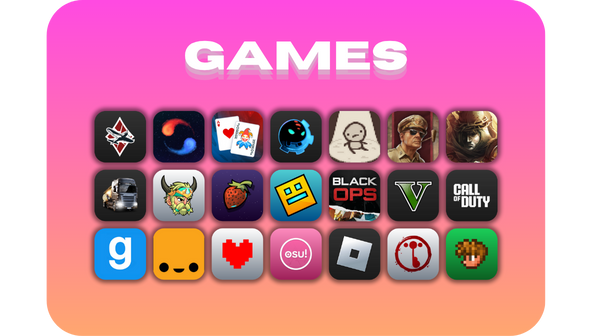

# Games for Hatter

---
##### Extra game icons for the [Hatter](https://github.com/Mibea/Hatter) Icon Theme, because i care too much about theme/UI consistency
---
### Hatter
> It's a rounded square icon theme for linux desktops. The goal is to integrate well with the default Gnome desktop asthetics with rounded windows and buttons. It is also reported to work well on KDE, XFCE and Mate. The design philosophy is to create a rounded square theme that is faithful to the application's identity, name and branding. (from Hatter's GitHub repo)
